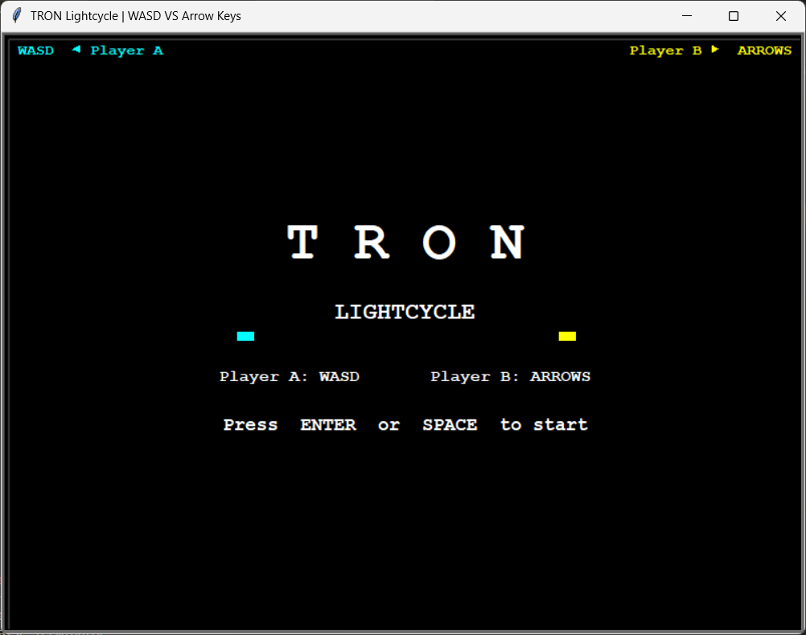
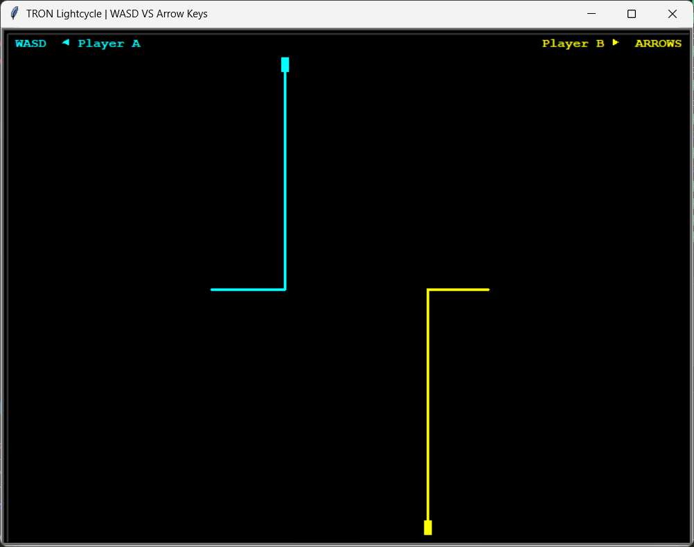
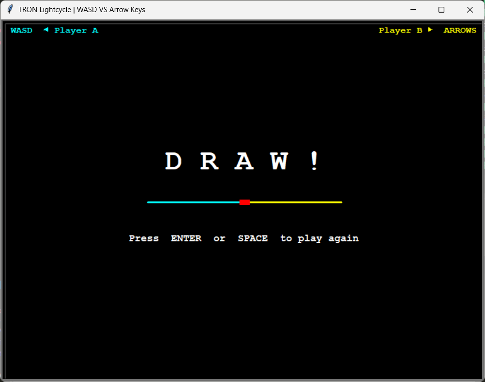
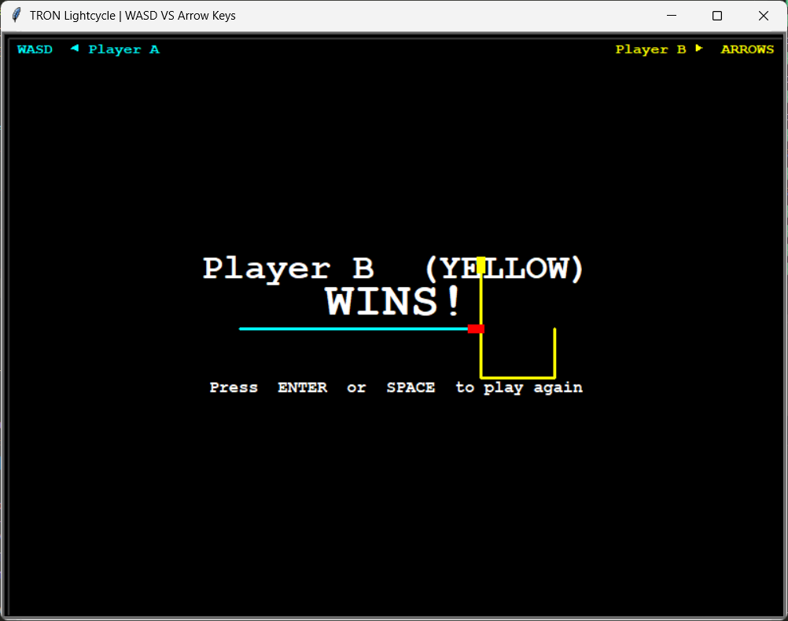

# TRON Lightcycle - Two Player Game

A modern, object-oriented implementation of the classic TRON Lightcycle game in Python. Two players compete in a high-speed arena, leaving trails behind them. Avoid walls and colliding with trails to become the last survivor!

## 🔴 Live Demo

Experience the game instantly at: https://tron-lightcycle-game.vercel.app

## 🎮 Features

- ✅ **Two-Player Gameplay** - Player A (WASD) vs Player B (Arrow Keys)
- ✅ **Real-Time Collision Detection** - Walls, opponent trails, and self-collision
- ✅ **Smooth Movement** - ~75 FPS for fluid gameplay
- ✅ **Clean Architecture** - Well-organized classes for easy maintenance and extension
- ✅ **Visual Feedback** - Color-coded players, HUD, and end-game screens
- ✅ **Replayability** - Press ENTER/SPACE to play again after each round

## 📋 System Requirements

- Python 3.7 or higher
- `turtle` module (included with Python)
- Windows, macOS, or Linux

## 🚀 Installation & Setup

### 1. Clone or Download the Project

```bash
git clone https://github.com/fardinfaruqi/TRON-Lightcycle-Game--Two-Player
cd "TRON-Lightcycle-Game--Two-Player"
```

### 2. Install Dependencies

The only dependency is the `turtle` module, which comes built-in with Python. No additional installation needed!

### 3. Run the Game

```bash
python Tron_Lightcycle.py
```

Or use Python 3 directly:

```bash
python3 Tron_Lightcycle.py
```

## 🎯 How to Play

### Controls

| Player | Action | Keys |
|--------|--------|------|
| **Player A** | Move Up | `W` |
| | Move Down | `S` |
| | Move Left | `A` |
| | Move Right | `D` |
| **Player B** | Move Up | `↑` (Up Arrow) |
| | Move Down | `↓` (Down Arrow) |
| | Move Left | `←` (Left Arrow) |
| | Move Right | `→` (Right Arrow) |

### Game Controls

- **Start Game**: Press `ENTER` or `SPACE`
- **Play Again**: Press `ENTER` or `SPACE` after game ends

### Game Rules

1. Each player controls a light cycle that leaves a trail behind it
2. The cycles move continuously in the current direction
3. Use arrow keys or WASD to change direction (but NOT 180° U-turns)
4. **Collision Detection**:
   - Hit a wall → You lose
   - Hit an opponent's trail → You lose
   - Hit your own trail → You lose
   - Both players collide → Draw

5. Last player standing wins!

## 📁 Project Structure

```
TRON Lightcycle Game — Two Player/
├── Tron_Lightcycle.py                 # Main entry point
├── classes/
│   ├── constants.py                   # Game configuration & constants
│   ├── arena.py                       # Arena class (boundaries & borders)
│   ├── player.py                      # Player class (cycle management)
│   ├── collision_detector.py          # CollisionDetector class (physics)
│   ├── input_handler.py               # InputHandler class (controls)
│   ├── ui_renderer.py                 # UIRenderer class (graphics)
│   ├── game_state.py                  # GameState class (state management)
│   └── game.py                        # Game class (main orchestrator)
├── .gitignore                         # Ignores cache files
└── README.md                          # This file
```

## 🏗️ Architecture Overview

The project follows **Object-Oriented Design** principles with clear separation of concerns:

### Core Classes

#### **`Game`** (Main Orchestrator)
- Initializes all game components
- Runs the main game loop
- Handles game flow (start, update, collision check, render)

#### **`Player`**
- Manages player state (position, heading, color)
- Handles movement and trail recording
- Provides direction queuing (prevents 180° turns)

#### **`Arena`**
- Defines game boundaries
- Draws arena border
- Validates if positions are within bounds

#### **`CollisionDetector`**
- Detects collisions with walls
- Detects collisions with opponent trails
- Detects collisions with own trail (with grace period for safety)

#### **`InputHandler`**
- Binds keyboard inputs to player actions
- Separates input logic from game logic

#### **`UIRenderer`**
- Renders splash screen
- Draws HUD (heads-up display)
- Displays end-game results
- Manages all text rendering

#### **`GameState`**
- Tracks game status (running, game_over, winner)
- Manages frame counter
- Determines when to sample trail positions

#### **`Constants`**
- Centralized configuration (arena size, speed, collision radius, etc.)
- Easy tuning for game balance

## 🎨 Game Screenshots

> *Screenshots of the game:*
> - Game splash screen
    
> - Active gameplay
    
> - End-game screen (winner/draw)
    
    

## ⚙️ Configuration & Tuning

Edit `classes/constants.py` to customize game behavior:

```python
WIDTH, HEIGHT = 800, 600          # Arena size (pixels)
STEP = 5                          # Movement speed (pixels per frame)
FRAME_DELAY = 0.013               # Frame timing (~75 FPS)
TRAIL_THICKNESS = 3               # Trail width (pixels)
TRAIL_SAMPLE = 4                  # Record trail every N frames (optimization)
COLLISION_RADIUS = 6              # Collision detection radius (pixels)
GRACE_FRAMES = 30                 # Frames before self-collision is detected
```

### Example: Make the Game Faster
```python
STEP = 8                          # Increase from 5 to 8
FRAME_DELAY = 0.010              # Decrease from 0.013 to 0.010
```

### Example: Larger Arena
```python
WIDTH = 1200
HEIGHT = 800
```

## 🔧 Development & Extension

The modular architecture makes it easy to add new features:

### Adding Sound Effects
Create a `sound_manager.py` class and integrate with the `Game` class.

### Adding AI Players
Extend the `Player` class or create an `AIPlayer` subclass with decision logic.

### Adding Power-ups
Create a `PowerUp` class and integrate collision detection in `CollisionDetector`.

### Adding Game Modes
Extend `GameState` with additional states (pause, rounds, multiplayer modes).

### Adding Difficulty Levels
Modify constants or create a `Difficulty` configuration class.

## 🐛 Debugging Tips

1. **Check Terminal Output** - Run from terminal to see any error messages
2. **Verify Python Version** - Ensure Python 3.7+ is installed:
   ```bash
   python --version
   ```
3. **Check Dependencies** - Turtle is built-in; no external packages needed
4. **Window Not Appearing?** - Ensure your display supports turtle graphics

## 📝 Code Quality

- **Type Hints** - All functions have type annotations
- **Docstrings** - Every class and method is documented
- **Clean Naming** - Descriptive class and method names
- **Single Responsibility** - Each class has one clear purpose
- **DRY Principle** - No code duplication

## 🎓 Educational Value

This project is excellent for learning:
- **Object-Oriented Programming** (OOP)
- **Game Development Basics** (game loops, collision detection, state management)
- **Python Best Practices** (type hints, docstrings, project structure)
- **Design Patterns** (separation of concerns, single responsibility principle)

## 📄 License

This project is open source and available for educational purposes.

## 🤝 Contributing

Improvements and contributions are welcome! Potential areas:

- Performance optimization (spatial indexing for collision)
- Network multiplayer support
- Sound effects and background music
- Additional visual effects (trail effects, animations)
- Difficulty levels and leaderboards
- Mobile/touch controls support
- Obstacle generation (randomly placed blocks)

## 📞 Support & Issues

If you encounter issues:
1. Verify Python version (3.7+)
2. Check that all module files are in the `classes/` directory
3. Ensure turtle graphics library is available
4. Run from terminal to see error messages

## 🎮 Game Tips

- **Early Game** - Move aggressively and control the center
- **Mid Game** - Start creating barriers to trap opponents
- **End Game** - Force opponents into tight corners
- **Control** - Remember you can't make 180° turns; plan ahead!

---

**Enjoy the game! May the best player win! 🏆**
